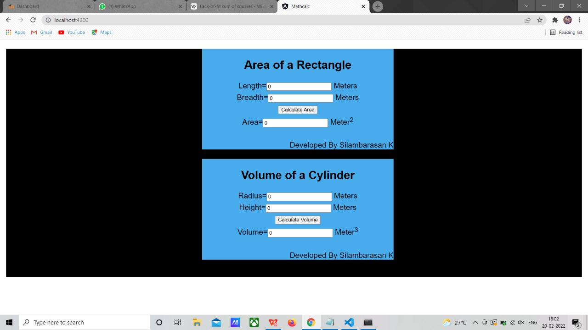

# AngularCalculation

# Web Page for Mathematical Calculations using Angular

## AIM:
To design a dynamic website to perform mathematical calculations using Angular Framwork

## DESIGN STEPS:

### Step 1:

Requirement collection.

### Step 2:

Creating the layout using HTML and CSS in component.html file

### Step 3:

Write typescript to perform the calculations.

### Step 4:

Validate the layout in various browsers.

### Step 5:

Validate the HTML code.

### Step 6:

Publish the website in the given URL.

## PROGRAM :
### app.component.html:
```
<body>
  <div class="container">
  <div class="content">
  <Rectangle-Area></Rectangle-Area>
  <div class="footer">Developed By Silambarasan K</div>
  </div>
  <div class="content">
    <Cylinder-Volume></Cylinder-Volume>
    <div class="footer">Developed By Silambarasan K</div>
    </div>
    </div>
    </body>
```
### app.component.spec.css:
```
* {
    box-sizing:border-box;
    font-family: Arial, Helvetica, sans-serif;
  }
  body {
    background-color:rgb(0, 0, 0);
  }
  .container {
    width:1080px;
    margin-left: auto;
    margin-right: auto;
    padding-left: 300px;
    max-height:max-content;
    background-color:rgb(0, 0, 0);
    padding-bottom: 45px; ;
  }
  .content {
    display:block;
    width: 500px;
    background-color:rgb(72, 171, 236);
    min-height: 150px;
    font-size: 20px;
    position:relative;
    
  }
  h1{
    text-align: center;
    color:rgb(255, 255, 255);
  }
  
  .footer {
    display: inline-block;
    width: 100%;
    height: 40px;
    background-color:rgb(72, 171, 236);
    text-align:right;
    padding-top: 30px;
    margin: 0px 0px 0px 0px;
    color: black
  }
```
### app.component.ts
```
import { TestBed } from '@angular/core/testing';
import { AppComponent } from './app.component';

describe('AppComponent', () => {
  beforeEach(async () => {
    await TestBed.configureTestingModule({
      declarations: [
        AppComponent,
      ],
    }).compileComponents();
  });

  it('should create the app', () => {
    const fixture = TestBed.createComponent(AppComponent);
    const app = fixture.componentInstance;
    expect(app).toBeTruthy();
  });

  it(`should have as title 'mathcalc'`, () => {
    const fixture = TestBed.createComponent(AppComponent);
    const app = fixture.componentInstance;
    expect(app.title).toEqual('mathcalc');
  });

  it('should render title', () => {
    const fixture = TestBed.createComponent(AppComponent);
    fixture.detectChanges();
    const compiled = fixture.nativeElement as HTMLElement;
    expect(compiled.querySelector('.content span')?.textContent).toContain('mathcalc app is running!');
  });
});
```
### app.component.ts

```
import { Component } from '@angular/core';

@Component({
  selector: 'app-root',
  templateUrl: './app.component.html',
  styleUrls: ['./app.component.css']
})
export class AppComponent {
  title = 'mathcalculations';
}
```
### app.module.ts
```
import { NgModule } from '@angular/core';
import { FormsModule } from '@angular/forms';
import { BrowserModule } from '@angular/platform-browser';

import { AppComponent } from './app.component';
import { CylinderComponent } from './cylinder/cylinder.component';
import { RectangleComponent } from './rectangle/rectangle.component';


@NgModule({
  declarations: [
    AppComponent,RectangleComponent,CylinderComponent
  ],
  imports: [
    BrowserModule,FormsModule,
  ],
  providers: [],
  bootstrap: [AppComponent]
})
export class AppModule { }
```
### retangle.component.css
```
* {
    box-sizing: border-box;
    font-family: Arial, Helvetica, sans-serif;
  }
  .container {
    width: 1080px;
    margin-left: auto;
    margin-right: auto;
    padding-top: 30px;
    padding-left: 300px;
    padding-bottom: 500px;
  }
  .content {
    display:block;
    width: 500px;
    background-color:white;
    min-height: 150px;
    font-size: 20px;
  }
  h2{
      text-align: center;
      padding-top: 25px;
  }
  .formelement{
      text-align: center;
      margin-top: 5px;
      margin-bottom: 5px;
  }
```
### rectangle.component.html
```
<h2>Area of a Rectangle</h2>
    <div class="formelement">
    Length=<input type="text" [(ngModel)]="length"> Meters <br/>
    </div>
    <div class="formelement">
    Breadth=<input type="text" [(ngModel)]="breadth"> Meters <br/>
    </div>
    <div class="formelement">
        <input type="button" (click)="onCalculate()" value="Calculate Area"> <br/>
    </div>
    <div class="formelement">
    Area=<input type="text" [value]="area"> Meter<sup>2</sup>
    </div>
```
### rectangle.component.ts
```
import { Component } from "@angular/core"

@Component({
    selector: 'Rectangle-Area',
    templateUrl:'./rectangle.components.html',
    styleUrls:['./rectangle.component.css']
})
export class RectangleComponent{
    length:number;
    breadth:number;
    area:number;
    constructor(){
        this.length=0;
        this.breadth=0;
        this.area =this.length * this.breadth;

    }
    onCalculate()
    {
        this.area =  this.length * this.breadth;
    }
}
```
### cylinder.component.css
```
* {
    box-sizing: border-box;
    font-family: Arial, Helvetica, sans-serif;
  }
  h2{
      text-align: center;
      padding-top: 25px;
  }
  .formelement{
      text-align: center;
      margin-top: 5px;
      margin-bottom: 5px;
  }

```
###  cylinder.component.html
```
<h2>Volume of a Cylinder</h2>
<div class="formelement">
Radius=<input type="text" [(ngModel)]="radius"> Meters <br/>
</div>
<div class="formelement">
Height=<input type="text" [(ngModel)]="height"> Meters <br/>
</div>
<div class="formelement">
    <input type="button" (click)="onCalculate()" value="Calculate Volume"> <br/>
</div>
<div class="formelement">
Volume=<input type="text" [value]="volume"> Meter<sup>3</sup>
</div>
```
### cylinder.component.ts
```
import { Component } from "@angular/core"

@Component({
    selector: 'Cylinder-Volume',
    templateUrl:'./cylinder.component.html',
    styleUrls:['./cylinder.component.css']

})
export class CylinderComponent{
    radius:number;
    height:number;
    volume:number;
    constructor(){
        this.radius=0;
        this.height=0;
        this.volume =3.14 * this.radius * this.radius * this.height ;
        
    }
    onCalculate()
    {
        this.volume = 3.14 * this.radius * this.radius * this.height ;
    }
}
```
## OUTPUT:


## Result:
This is code is executed successfully to create a webpage to make mathematical calculations using angular.
